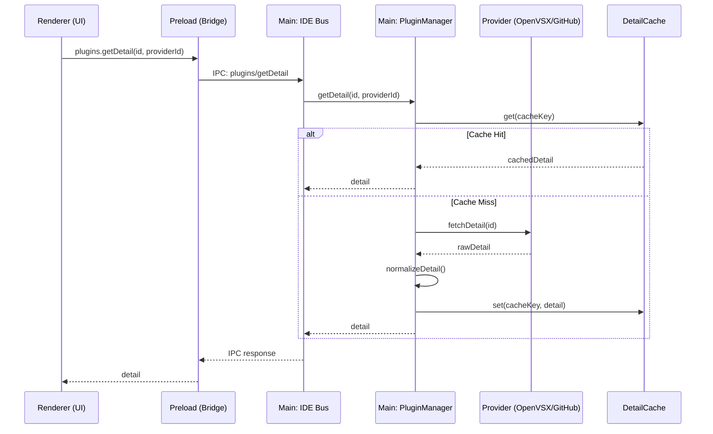

# Design Document: Plugin Detail API

## Overview

本设计文档描述了 IDE 插件详情 API 的技术实现方案。该功能将完善插件系统的数据链路，使 Renderer 进程（UI 层）能够获取并展示插件的详细信息（README、changelog、功能列表等）。

设计遵循 IDE_Data_Exchange_Plan 中定义的架构原则：
- **进程隔离**：Renderer 进程与 Main 进程通过 IPC 通信
- **统一协议**：基于 JSON-RPC 2.0 的 IDE Bus
- **Provider 模式**：支持多数据源（OpenVSX、GitHub、Official）

## Architecture

本设计符合 VS Code / Electron 的标准进程模型：

```
┌─────────────────────────────────────────────────────────┐
│                    Electron 应用                         │
├─────────────────────────────────────────────────────────┤
│  Renderer 进程 (UI)                                     │
│       ↕ contextBridge / IPC                             │
│  Preload (桥接层)                                       │
│       ↕ ipcRenderer ↔ ipcMain                           │
│  Main 进程 (IDE Core)                                   │
│       ├── IDE Bus (JSON-RPC 路由)                       │
│       ├── PluginManager                                 │
│       └── Providers (OpenVSX/GitHub/Official)           │
└─────────────────────────────────────────────────────────┘
```

### 数据流序列图



## Components and Interfaces

### 1. PluginDetail 数据结构

```typescript
interface PluginDetail {
  id: string;                    // 插件 ID，如 "saoudrizwan.claude-dev"
  name: string;                  // 显示名称
  version: string;               // 版本号
  description: string;           // 简短描述
  readme: string | null;         // README 内容 (Markdown)
  changelog: string | null;      // Changelog 内容 (Markdown)
  categories: string[];          // 分类标签
  capabilities: string[];        // 功能列表
  dependencies: Dependency[];    // 依赖项
  repository: string | null;     // 仓库 URL
  license: string | null;        // 许可证
  publisher: Publisher;          // 发布者信息
  statistics: Statistics | null; // 统计信息
  lastUpdated: number;           // 最后更新时间戳
  source: PluginSource;          // 来源信息
}

interface Dependency {
  id: string;
  version: string;
  optional: boolean;
}

interface Publisher {
  name: string;
  url: string | null;
}

interface Statistics {
  downloads: number;
  rating: number | null;
  reviewCount: number;
}

interface PluginSource {
  providerId: string;
  namespace?: string;
  name?: string;
}
```

### 2. Provider Interface 扩展

```typescript
interface PluginProvider {
  id: string;
  search(query: string, options?: SearchOptions): Promise<PluginSearchResult[]>;
  get(id: string, version?: string): Promise<PluginSpec | null>;
  // 新增方法
  getDetail(id: string, version?: string): Promise<PluginDetail | null>;
}
```

### 3. DetailCache 接口

```typescript
interface DetailCache {
  get(key: string): CachedDetail | null;
  set(key: string, detail: PluginDetail, ttlMs?: number): void;
  invalidate(key: string): void;
  clear(): void;
}

interface CachedDetail {
  detail: PluginDetail;
  cachedAt: number;
  expiresAt: number;
}
```

### 4. IDE Bus 方法 (Main 进程)

```typescript
// 请求 (Renderer → Main)
interface GetDetailRequest {
  id: string;           // 插件 ID
  providerId?: string;  // Provider ID (可选，默认自动检测)
  version?: string;     // 版本号 (可选，默认最新)
  forceRefresh?: boolean; // 强制刷新缓存
}

// 响应 (Main → Renderer)
interface GetDetailResponse {
  ok: boolean;
  detail?: PluginDetail;
  error?: string;
  cached?: boolean;     // 是否来自缓存
}
```

### 5. Preload API (桥接层)

```typescript
// electron/preload.js 中暴露给 Renderer
plugins: {
  // 现有方法...
  getDetail: (id: string, providerId?: string, options?: { forceRefresh?: boolean }) =>
    tryBus('plugins/getDetail', { id, providerId, ...options })
}
```

## Data Models

### OpenVSX API 响应映射

```typescript
// OpenVSX /api/{namespace}/{name} 响应
interface OpenVsxExtension {
  namespace: string;
  name: string;
  displayName: string;
  description: string;
  version: string;
  readme?: string;           // README 内容
  changelog?: string;        // Changelog 内容
  categories?: string[];
  tags?: string[];
  license?: string;
  repository?: string;
  downloadCount?: number;
  averageRating?: number;
  reviewCount?: number;
  publishedBy?: {
    loginName: string;
  };
}
```

### GitHub API 响应映射

```typescript
// GitHub /repos/{owner}/{repo} 响应
interface GitHubRepo {
  description: string;
  html_url: string;
  license?: { spdx_id: string };
  owner: { login: string; html_url: string };
}

// GitHub /repos/{owner}/{repo}/readme 响应
interface GitHubReadme {
  content: string;  // Base64 encoded
  encoding: string;
}

// GitHub /repos/{owner}/{repo}/releases 响应
interface GitHubRelease {
  tag_name: string;
  body: string;     // Release notes (Markdown)
  published_at: string;
}
```

## Correctness Properties

*A property is a characteristic or behavior that should hold true across all valid executions of a system-essentially, a formal statement about what the system should do. Properties serve as the bridge between human-readable specifications and machine-verifiable correctness guarantees.*

### Property 1: Detail Response Structure Completeness

*For any* valid plugin ID and provider, when requesting plugin details, the response SHALL contain all required fields (id, name, version, description, source) with correct types, and optional fields (readme, changelog, capabilities) SHALL be either valid strings/arrays or null.

**Validates: Requirements 1.1, 1.2, 1.3, 1.4**

### Property 2: Provider Response Normalization

*For any* raw response from OpenVSX or GitHub API, the normalization function SHALL produce a valid PluginDetail object with all required fields populated, and SHALL not throw exceptions for missing optional fields.

**Validates: Requirements 2.1, 2.2, 2.4**

### Property 3: Error Response Consistency

*For any* invalid plugin ID or failed network request, the system SHALL return a response with `ok: false` and a non-empty `error` string describing the failure reason.

**Validates: Requirements 1.5**

### Property 4: Cache Lifecycle Correctness

*For any* successfully fetched plugin detail, the cache SHALL store the detail with correct TTL, return cached data for subsequent requests within TTL, and fetch fresh data after TTL expires or when forceRefresh is true.

**Validates: Requirements 5.1, 5.2, 5.3, 5.4**

### Property 5: IPC Request-Response Integrity

*For any* `plugins/getDetail` request through IDE Bus (IPC), the response SHALL contain the same plugin ID as requested, and the detail object (if present) SHALL match the PluginDetail schema.

**Validates: Requirements 3.1, 3.2**

## Error Handling

### Network Errors (Main 进程)
- 连接超时：30 秒后返回 timeout 错误
- HTTP 错误：返回状态码和错误信息
- 解析错误：返回 parse error 并记录日志

### Provider Errors (Main 进程)
- Provider 不存在：返回 "unknown provider" 错误
- API 限流：返回 rate limit 错误，建议稍后重试
- 插件不存在：返回 "plugin not found" 错误

### Cache Errors (Main 进程)
- 缓存读取失败：静默忽略，继续网络请求
- 缓存写入失败：静默忽略，不影响响应

## Testing Strategy

### Unit Testing (Main 进程)
- 测试 PluginDetail 数据结构验证
- 测试各 Provider 的响应解析逻辑
- 测试缓存的 get/set/invalidate 操作
- 测试 IDE Bus 请求路由

### Property-Based Testing
使用 fast-check 库进行属性测试：

1. **Response Structure Property**: 生成随机 plugin ID，验证响应结构
2. **Normalization Property**: 生成随机 API 响应，验证规范化输出
3. **Cache Property**: 生成随机操作序列，验证缓存行为
4. **Error Property**: 生成无效输入，验证错误响应

### Integration Testing
- 测试完整的 Renderer → Main → Provider 数据流
- 测试真实 OpenVSX API 调用（需要网络）
- 测试 UI 组件的 Markdown 渲染
