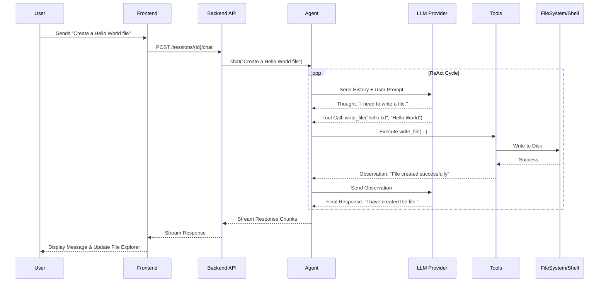

# AI Agent App Architecture

This document provides a comprehensive overview of the AI Agent App's architecture, including its components, data flow, and service interactions.

## 1. High-Level Architecture

The application follows a **Client-Server** architecture, integrated with an **Autonomous Agent** loop.

```mermaid
graph TD
    User[User] -->|Interacts| Frontend[Frontend (React + Vite)]
    
    subgraph "Backend (Python + FastAPI)"
        API[API Gateway (main.py)]
        Agent[Agent Core (agent.py)]
        DB[(SQLite Database)]
        
        subgraph "Core Services"
            LLM[LLM Client]
            Tools[Tool Manager]
        end
    end
    
    subgraph "External Services"
        OpenAI[OpenAI API]
        Anthropic[Anthropic API]
    end
    
    subgraph "Local Environment"
        FS[File System / Workspace]
        Shell[System Shell]
    end

    Frontend <-->|HTTP/WebSocket| API
    API <--> DB
    API --> Agent
    Agent --> LLM
    LLM --> OpenAI
    LLM --> Anthropic
    Agent <--> Tools
    Tools --> FS
    Tools --> Shell
```

## 2. Component Details

### 2.1 Frontend (`/frontend`)
Built with **React** and **Vite**, serving as the control interface.
- **Chat Interface**: Displays conversation history and streams AI responses.
- **Workspace Explorer**: Visualizes the file structure of the bound project.
- **Config Panel**: Manages LLM settings (API keys, models).
- **Communication**: Uses standard HTTP requests for actions and Server-Sent Events (streaming) for chat responses.

### 2.2 Backend (`/backend`)
Built with **FastAPI**, serving as the brain and orchestrator.

#### A. API Gateway (`main.py`)
- **Entry Point**: Handles HTTP requests.
- **Workspace Binding**: Middleware (`_ensure_workspace_bound`) ensures the agent operates within a specific project directory.
- **Session Management**: CRUD operations for chat sessions.

#### B. Agent Core (`agent.py`)
- **ReAct Loop**: Implements the "Reasoning + Acting" loop.
- **Mode Management**:
  - `chat`: Pure conversation.
  - `plan`: Project planning and task breakdown.
  - `canva`: Frontend/Full-stack coding (File I/O enabled).
  - `agent`: Full autonomy (Shell + File I/O + System Control).
- **Context Management**: Maintains conversation history and system prompts.

#### C. LLM Abstraction (`core/llm_client.py`)
- **Unified Interface**: `LLMClient` abstract base class.
- **Providers**: `OpenAIProvider` and `AnthropicProvider` handle API-specific logic.

#### D. Tools (`tools/`)
Capabilities exposed to the LLM:
- **FileSystem**: `read_file`, `write_file`, `list_files`, `search_in_files`.
- **Shell**: `execute_shell` (run commands like `npm install`, `python script.py`).
- **System**: `screen_capture`, `mouse_control`, `keyboard_control`.

#### E. Persistence (`database.py`)
- **SQLite**: Stores sessions, messages, and settings.
- **Schema**:
  - `sessions`: ID, title, mode, timestamps.
  - `messages`: Role, content (JSON payload), session_id.
  - `kv_store`: Config persistence.

## 3. Data Flow: Chat & Execution

Sequence of events when a user sends a request:



## 4. Key Design Patterns

- **Dependency Injection**: The `Agent` receives `LLMClient` instances, allowing easy swapping of models.
- **Tool-Use Policy**: The `Agent` filters available tools based on the active `mode`. For example, `chat` mode has no tools, while `agent` mode has all tools.
- **Stateless/Stateful Hybrid**: The API is RESTful (stateless), but the `Agent` reconstructs state (history) from the database for each request.

## 5. Directory Structure

```
root/
├── backend/            # Python FastAPI Server
│   ├── core/           # LLM Providers & Base Classes
│   ├── tools/          # Tool Implementations
│   ├── agent.py        # Agent Logic
│   ├── main.py         # API Entry Point
│   └── database.py     # SQLite Access
├── frontend/           # React Application
├── electron/           # Desktop Wrapper (Optional)
└── ai_agent.db         # Local Database
```
